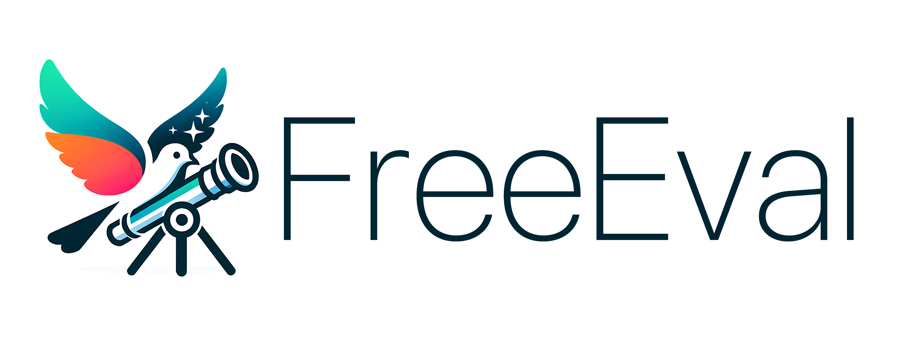
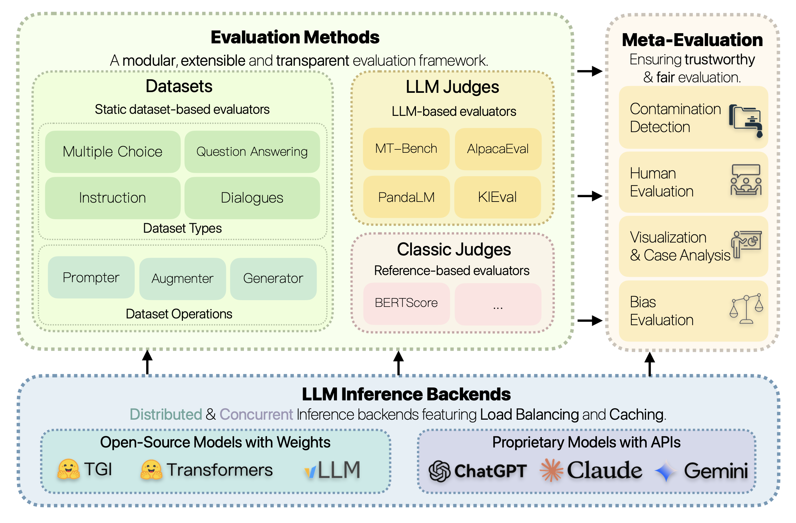

<div align="center">




**FreeEval: A Modular Framework for Trustworthy and Efficient Evaluation of Large Language Models**

------

<p align="center">
  <a href="#overview">Overview</a> •
  <a href="#quick-start">Quick Start</a> •
  <a href="https://freeeval.readthedocs.io/">Docs</a> •
  <a href="https://arxiv.org/abs/2404.06003">Paper</a> •
  <a href="#citation">Citation</a>
</p>

</div>


## Overview

FreeEval is a modular and extensible framework for conducting trustworthy and efficient automatic evaluations of large language models (LLMs). The toolkit unifies various evaluation approaches, including dataset-based evaluators, reference-based metrics, and LLM-based evaluators, within a transparent and reproducible framework. FreeEval incorporates meta-evaluation techniques such as human evaluation and data contamination detection to enhance the reliability of evaluation results. The framework is built on a high-performance infrastructure that enables efficient large-scale evaluations across multi-node, multi-GPU clusters, supporting both open-source and proprietary LLMs. With its focus on modularity, trustworthiness, and efficiency, FreeEval aims to provide researchers with a standardized and comprehensive platform for gaining deeper insights into the capabilities and limitations of LLMs.

<div align="center">

</div>

## Quick Start

To get started, first clone the repository and setup the enviroment:

```bash
git clone https://github.com/WisdomShell/FreeEval.git
cd FreeEval
pip install -r requirements.txt
```

All our evaluation pipelines are configured with JSON configs, including all the details and hyper-parameters.
For an example, you could run ARC-Challenge with LLaMA-2 7B Chat with:

```bash
python run.py -c ./config/examples/arcc.json
```

## Docs

For more detailed usage, please refer to our [docs](https://freeeval.readthedocs.io/).

## Citation

✨ If you find our work helpful, please consider citing with:

```bibtex

@article{yu2024freeeval,
  title={FreeEval: A Modular Framework for Trustworthy and Efficient Evaluation of Large Language Models},
  author={Yu, Zhuohao and Gao, Chang and Yao, Wenjin and Wang, Yidong and Zeng, Zhengran and Ye, Wei and Wang, Jindong and Zhang, Yue and Zhang, Shikun},
  journal={arXiv preprint arXiv:2404.06003},
  year={2024}
}
